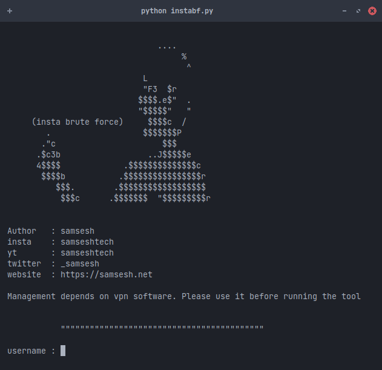

 # Brute-force-Instagram-2020


[]()
[]()
[]()
[]()

The brute force of Instagram is working in a new format 2020, just needs to add a proxy, and I didn't do it because of the limited time
Open source, you can modify it 

## A look at the tool




## Getting Started
1. ```git clone https://github.com/samsesh/insta-bf.git```
2. ```cd insta-bf```
3. ```python3 instabf.py```


## A Kali Linux operating system. We recommend :
- Kali Linux 2 or Kali 2016.1 rolling 
- Cyborg
- Parrot 
- BackTrack 
- Backbox  
- Android - Trimix
- Iphone - python ai 
- windows - wsl and python
## BUG ? 
- Please Submit new issue 

